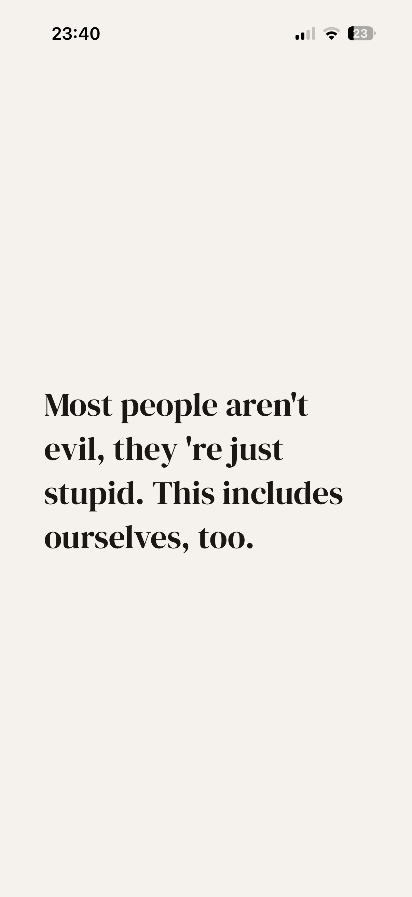

# smart shit

A minimal personal knowledge base. No spaced repetition, no review system — just a place to store thoughts, quotes, links, and notes you don't want to forget.

**[smart.ligaauguste.de](https://smart.ligaauguste.de)**

---

## What it does

- Write cards with a headline and body
- Organize cards into Stapel (stacks)
- Browse cards one at a time or as a scrollable list
- Full-text search
- 10 themes
- PWA — installable on mobile, supports iOS Share Sheet

## Stack

- **Backend:** Django, SQLite (dev) / PostgreSQL (prod)
- **Frontend:** Custom CSS, no framework, mobile-first
- **Fonts:** DM Serif Display + DM Mono (self-hosted)
- **Hosting:** Render

## Philosophy

Everything that isn't strictly necessary is left out.
